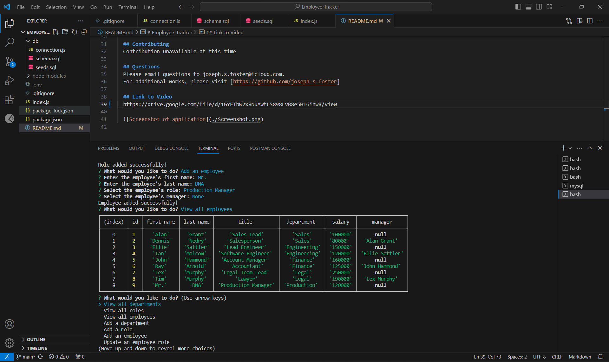

# Employee-Tracker

  ## Description
  This application allows the user to view and add contents to an employee database.

  - WHEN the application is ran
  - THEN the user is prompted with a list of options

  - WHEN the user selects any of the view options
  - THEN the corresponding table is shown

  - WHEN the user selects any of the add options
  - THEN the user can append corresponding data

  - WHEN the user views the table after the data is added
  - THEN the table will be updated with the corresponding addition

  ## Table of Contents
  - [Installation](#installation)
  - [Usage](#usage)
  - [Contributing](#contributing)
  - [Questions](#questions)
  - [Link](#link-to-site)

  ## Installation
  Via node.js, mysql2 and npm

  ## Usage
  n/a

  ## Contributing
  Contribution unavailable at this time

  ## Questions
  Please email questions to joseph.s.foster@icloud.com.
  For additional works, please visit [https://github.com/joseph-s-foster]

  ## Link to Video
  https://drive.google.com/file/d/1Z7BH1AnJINHIM-Pg0cQOXa6bt7kxcbSV/view

  
